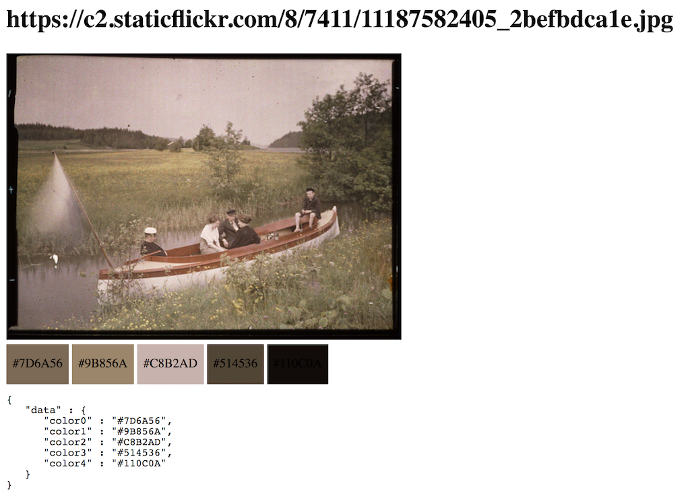

# Color Summarizer Web API

Runs the [color summarizer](http://mkweb.bcgsc.ca/color-summarizer/) as a web application that can be queried.

## To build and use

```
docker pull mgamga/color-summarizer
docker-compose build
docker-compose up
```

This will run the app in port `4567`. Test it visiting:

`http://localhost:4567/pretty?url=https://c2.staticflickr.com/8/7411/11187582405_2befbdca1e.jpg`

You should see something like this:



## Parameters

The app expects a `/:type?url=IMAGE_URL` request where `type` can be `text`, `json`, `xml`, or `pretty` and `url` has to be a valid URL to an image file. If no `type` is specified `json` will be assumed. `text` and `xml` will return complete image analysis while `json` will only return the five more prominent colors in the image.

## Source code

Get the source code in https://github.com/dpla/color-summarizer-docker

## Credits

[Matt Miller](https://github.com/thisismattmiller/color-summarizer-docker)
[James Higginbotham](https://dzone.com/articles/deploying-rest-apis-to-docker-using-ruby-and-sinat)
